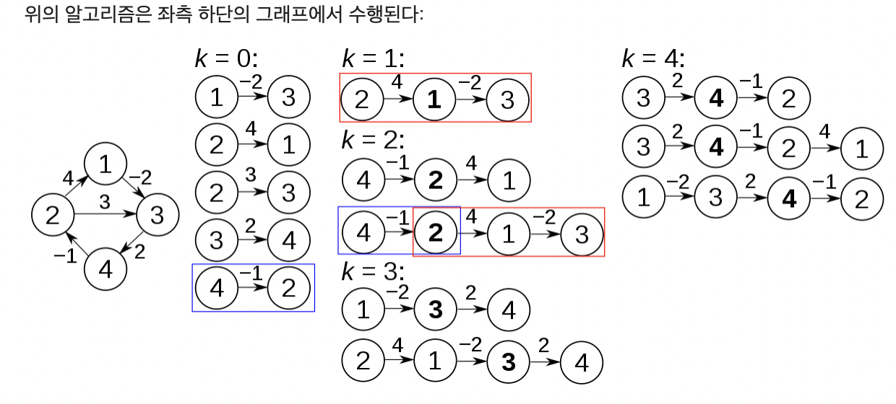

# 플로이드 워셜 알고리즘
     플로이드 와샬 알고리즘은 흔히 모든 정점에서 모든 정점으로 가는 최단 경로를 구할 때 사용한다.

     * 다익스트라와의 차이점
        - 다익스트라는 하나의 노드에서 다른 모든 노드로의 최단 경로를 구하는 알고리즘
        - 플로이드는 음의 가중치를 가진 간선에서도 제대로 동작한다

## 핵심 아이디어
    플로이드 와샬 알고리즘의 핵심 아이디어는 '거쳐가는 정점'을 기준으로 최단 거리를 구하는 것이다!
    노드x에서 노드y로 가는 최소 비용 vs 노드x에서 노드 k로 가는 비용 + 노드 k에서 노드 y로 가는 비용

! 출처: https://ko.wikipedia.org/wiki/%ED%94%8C%EB%A1%9C%EC%9D%B4%EB%93%9C-%EC%9B%8C%EC%85%9C_%EC%95%8C%EA%B3%A0%EB%A6%AC%EC%A6%98
## 구현 

